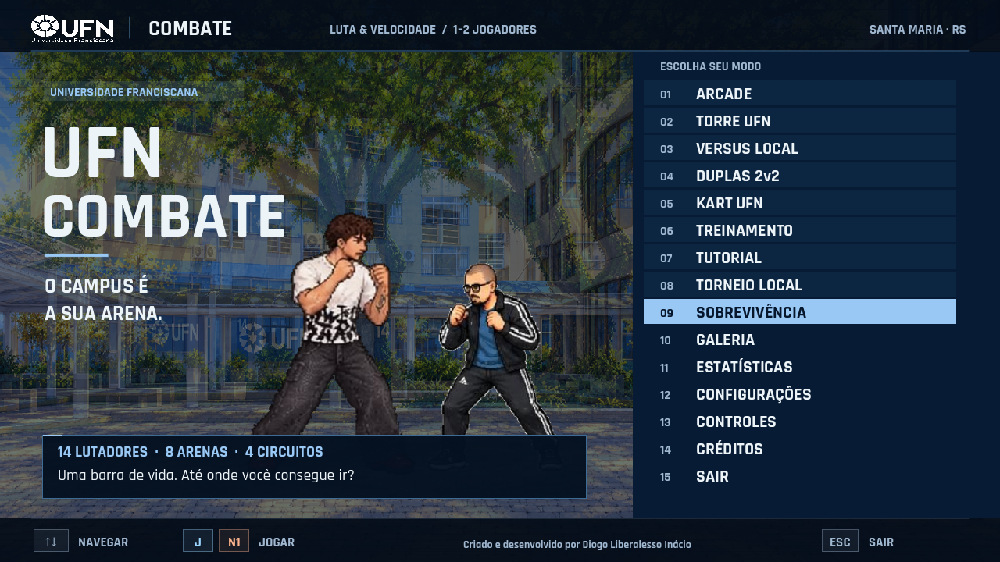
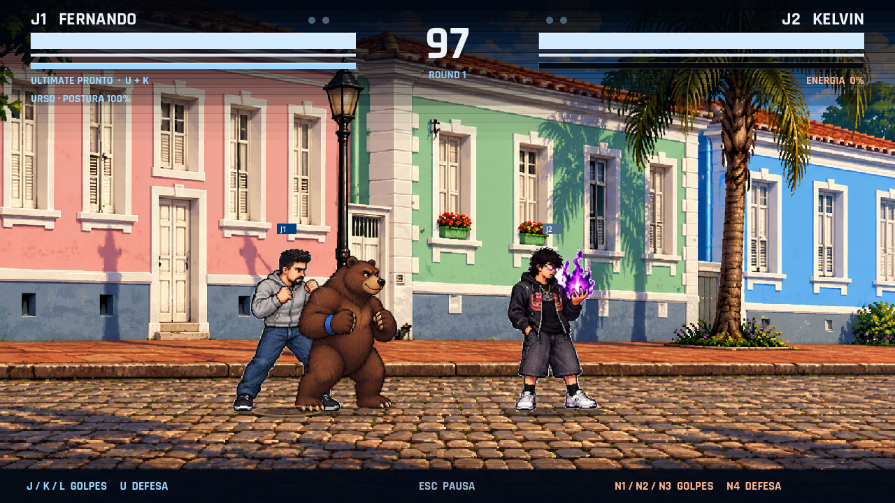
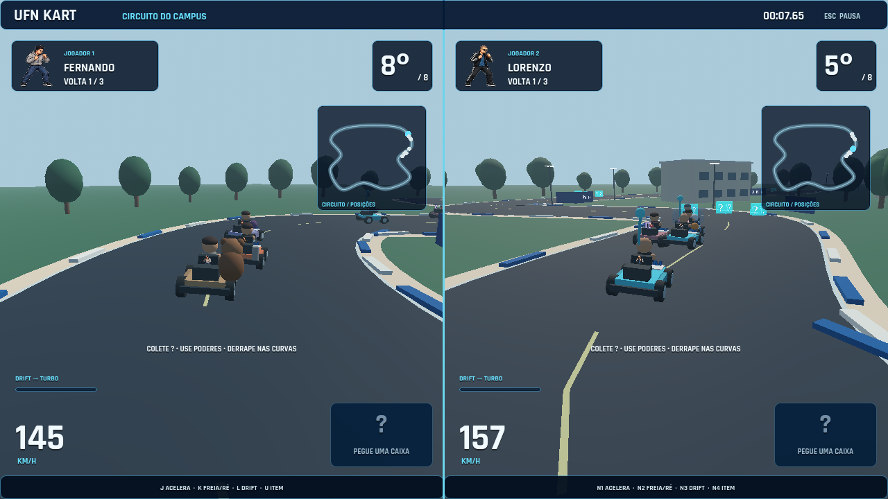

# UFN Combate — Edição Campus

**Versão 0.2.0 · Windows x64 · Godot 4.7.2**

Luta 2D com personagens da comunidade, cenários inspirados na UFN e em Santa Maria, e um modo de kart 3D para até dois jogadores locais.

**Criado e desenvolvido por Diogo Liberalesso Inácio.**

Feito por Diogo Liberalesso Inácio. Para contato ou feedback, fale no Instagram [@diogok_i](https://www.instagram.com/diogok_i/) ou pelo e-mail [diogolib.inacio200@gmail.com](mailto:diogolib.inacio200@gmail.com)!



## Jogar no Windows

Baixe o pacote Windows na [Release v0.2.0](https://github.com/diogolibinacio200-coder/ufn-combate/releases/tag/v0.2.0), extraia o ZIP e execute **UFNCombate.exe**. Mantenha **UFNCombate.exe** e **UFNCombate.pck** juntos na mesma pasta: o primeiro executa a engine e o segundo contém os dados do jogo. Não é necessário instalar o editor Godot para jogar. O repositório é privado: os links exigem uma conta com acesso.

Esta distribuição preserva o executável oficial Godot 4.7.2, com assinatura digital válida, e carrega os dados do jogo no PCK separado. A assinatura autentica a engine; ela não certifica a autoria ou o conteúdo de UFN Combate.

No menu, navegue com W/S ou as setas e confirme com Enter ou A1. Escolha o modo, os personagens e o cenário. Esc volta ou abre a pausa. F11 alterna tela cheia.

## Controles

O jogo usa quatro ações: **A1** (leve), **A2** (forte), **A3** (chute) e **D** (defesa). Nesta notação, D significa a ação de defesa; não significa a tecla D do teclado.

| Ação | Jogador 1 | Jogador 2 | Gamepad, padrão Xbox |
|---|---|---|---|
| Mover, pular e agachar | WASD | Setas | Direcional / analógico esquerdo |
| A1 — leve | J | Num 1 | X |
| A2 — forte | K | Num 2 | Y |
| A3 — chute | L | Num 3 | A |
| D — defesa | U | Num 4 | LB |
| Pausa | Esc / Enter | Esc / Enter | Start |

| Técnica | Comando |
|---|---|
| Agarrão | D + A1 |
| Ultimate, com 100 de energia | D + A2 |
| Troca em Duplas | D + A3 |
| Especial A | ↓, frente + A1 |
| Especial B | ↓, trás + A1 |
| Especial C | ↓, ↓ + A2 |

Frente e trás acompanham o lado do adversário. A janela das sequências é de aproximadamente 300 ms. Segure defesa e pressione a outra ação; se várias ações chegarem juntas, a prioridade é A2, A3 e A1.

Em **Controles**, há remapeamento separado de luta e kart, seleção do dispositivo e teste das entradas. O **perfil sem numérico** usa WASD + F/G/H/R para J1 e setas + J/K/L/U para J2. Teclado, dois gamepads e combinações entre eles são aceitos pelo sistema de entrada. O funcionamento simultâneo de dois controles físicos ainda precisa de validação no hardware de destino.

A lista completa está em [GOLPES.md](GOLPES.md) e no guia acessível pela pausa.

## Modos

| Modo | Conteúdo |
|---|---|
| Arcade | Sequência de confrontos, chefes e final do personagem |
| Torre UFN | Oito oponentes jogáveis, André CSTH e Kelvin; progresso retomável |
| Versus Local | Dois humanos ou humano contra CPU |
| Duplas 2v2 | Dois lutadores por equipe; vida e energia individuais; troca com intervalo de 5 s |
| Kart UFN | Corrida rápida, campeonato de quatro etapas e contrarrelógio |
| Treinamento | Dummy configurável, vida/energia, hitboxes, histórico e troca de oponente |
| Tutorial | Etapas de movimento, golpes, defesa, agarrão, especiais, combo, Ultimate, troca e kart |
| Torneio Local | Chave de quatro ou oito participantes humanos/CPU |
| Sobrevivência | Rivais sucessivos, recuperação de 180 HP por vitória e recorde de pontuação |

O menu também inclui **Galeria, Estatísticas, Configurações, Controles, Créditos e Sair**: 15 entradas ao todo.

As lutas normais são melhor de três, com rounds de 99 segundos; Duplas usa 150 segundos. Sobrevivência usa um round por adversário. Empates não dão vitória de round e levam a outro round. Contra chefes, o desempate por tempo compara a proporção de vida restante.

## Elenco e arenas

**14 jogáveis:** Diogo, Vitor do Mal, Mirkos, Fabiano, Vitor do Bem, Murilo, Felipe, Maria, Gabriel, Arthur, Leonardo, Fernando, Cristian e Lorenzo. **Diogo Careca** é uma skin do Diogo, com os mesmos atributos e golpes. **André CSTH e Kelvin** são os dois chefes da torre e aparecem também na galeria e como oponentes do treino.

As oito arenas são Pátio da UFN, Espaço Container, Rua de Santa Maria, Entrada da UFN, Quadra Universitária, Laboratório Tecnológico, Corredor Universitário e Vila Belga. Pátio, entrada, rua e Vila Belga usam referências locais pesquisadas. As demais são interpretações temáticas; não são reproduções documentais de instalações específicas. Veja [as referências e o mapeamento das imagens](docs/REFERENCIAS.md).



## Kart UFN

Corrida rápida e campeonato têm **oito corredores**, sendo um ou dois humanos e o restante CPU. Há três voltas, checkpoints ordenados, caixas de itens, drift com miniturbo, escudos, obstáculos e um poder exclusivo para cada um dos 14 pilotos. O contrarrelógio tem um piloto, sem CPUs nem caixas.

Pistas: **Circuito do Campus, Volta da Vila Belga, Centro de Santa Maria e Desafio Universitário**. A tela pode ser dividida na vertical ou horizontal.

- **A1:** acelerar; **A2:** frear e dar ré; **A3:** drift; **D:** usar item.
- **Baixo + D:** lançar para trás os itens direcionais.
- **Esquerda/direita:** virar. Aceleração automática pode ser ativada nas configurações.
- **F2:** reposicionar J1; **Backspace:** reposicionar J2. O reposicionamento preserva a ordem de checkpoints.



## Configuração e progresso

Volumes geral, música, efeitos e narrador; tela cheia; 720p/1080p; qualidade padrão/leve; intensidade de tremor, flashes e partículas; legendas; texto ampliado; quatro dificuldades; aceleração automática e divisão de tela.

Configurações, controles, estatísticas, conquistas, torre, campeonato e recordes ficam em:

`%APPDATA%/Godot/app_userdata/UFN COMBATE/profile.json`

Há gravação temporária e cópia de recuperação. O jogo é local e não exige conexão durante as partidas.

## Abrir o projeto

1. Abra o editor **Godot 4.7.2 Standard**.
2. Importe `project.godot` e aguarde os recursos.
3. Use F5 para executar.

Renderer Compatibility/OpenGL; interface base de 1280 × 720; simulação a 60 Hz. Instruções de arquitetura, assets e exportação: [docs/TECHNICAL.md](docs/TECHNICAL.md).

```powershell
./tools/test.ps1 -Godot 'C:/caminho/Godot_v4.7.2-stable_win64_console.exe'
./tools/build.ps1 -Godot 'C:/caminho/Godot_v4.7.2-stable_win64_console.exe' -SignedRuntime 'C:/caminho/Godot_v4.7.2-stable_win64.exe'
```

## Estado da versão

Esta é uma versão jogável em desenvolvimento, com **489 verificações automatizadas sem falhas** na execução registrada. **60 FPS sustentados ainda não foram comprovados:** uma captura curta atingiu 60 FPS, mas sessões nativas de aproximadamente 96 segundos, com janela fora da tela e sem foco, registraram cerca de 27–31 FPS na luta e 17–21 FPS no kart dividido em 720p numa Intel Iris Xe. As condições e resultados de qualidade padrão/leve estão detalhados em [Evidências e limites](docs/QA.md).

As animações reaproveitam poses dos sprites enviados e movimento procedural; não têm 24 desenhos inéditos por animação. As arenas usam uma imagem principal com efeitos, e o kart usa modelos 3D simples. Coreografias corporais, paralaxe, modelagem, balanceamento e validação com jogadores/controles físicos continuam sendo frentes de aprimoramento.

O projeto aproveita a base técnica de [Nexus Kombat](https://github.com/diogolibinacio200-coder/nexus-kombat), expandida para esta edição. [Créditos, procedência e licenças](LICENSES.md).
